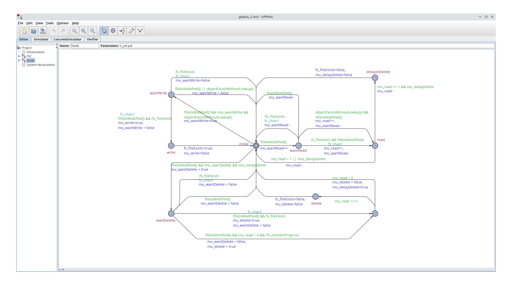

# Mini-Ceph

Mini-Ceph ist ein in Go geschriebener Prototyp, der die wichtigsten Eigenschaften des verteilten Object Storages Rados nachimplementiert. Rados ist die Kernkomponente von Ceph, die direkt für die Object-Storage-Funktionalität verwendet wird. „Höhere” Ceph-Features wie z.B. Blockstorage werden intern mit Rados realisiert. Ich habe den Prototypen dennoch aufgrund der größeren Bekanntheit des Namens Mini-Ceph genannt.

Der Prototyp basiert auf der Beschreibung von Ceph in der Doktorarbeit von Sage Weil[^1], sowie auf den separat veröffentlichten Artikeln zu Rados[^2] und Crush[^3]. Aufgrund der Komplexität wurden nur die wichtigsten Eigenschaften in zum Teil stark vereinfachter Form implementiert.

Mini-Ceph weist die wichtigsten Eigenschaften von Rados auf:

- Daten und damit verbundene Lese- und Schreibanfragen werden gleichmäßig auf alle Server verteilt.
- Es handelt sich um ein dezentrales Peer-to-Peer-Netzwerk.
- Create-, Read- und Delete-Operationen werden für Objekte unterstützt.
- Alle Daten sind aus Sicht der Clients zu jedem Zeitpunkt konsistent. Race Conditions sind ausgeschlossen und der wechselseitige Ausschluss im Konflikt stehender Aktionen (z.B. zwei gleichzeitige Create-Operationen auf dem selben Objekt) ist sichergestellt.
-  Alle Daten werden zur Steigerung der Verfügbarkeit redundant auf mehreren Servern abgelegt.

Aufgrund des prototypischen Charakters der Implementierung können nicht alle Features von Rados implementiert werden. Zu den wichtigsten fehlenden Aspekten gehören:

- Alle Objekte sind immutable und können nach dem anlegen nicht mehr modifiziert werden. Diese künstliche Beschränkung vereinfacht den wechselweisen Ausschluss und die Replikation immens.
- Die „Rollenverteilung” aller Knoten im Storage-Cluster wird beim Start fest vorgegeben und kann nachträglich nicht mehr geändert werden. Der Cluster ist außerstande, flexibel auf den Ausfall (oder das Hinzufügen) von Servern zu reagieren. Wenn ein Server ausfällt, können daher keine Operationen für Objekte mehr durchgeführt werden, die von diesem Server verwaltet werden.
  Um dieses Problem zu überwinden, ist es erforderlich, dass der Cluster als Ganzes sich über die (Nicht-) Verfügbarkeit einzelner Server bewusst ist und ggf. per Konsens eine neue Daten- und Rollenverteilung beschließt. Während die Daten zwischen den Servern transferiert werden und die Server ihre Rollen wechseln muss sichergestellt sein, dass diese Operationen für Clients transparent ablaufen und laufende Operationen nicht beeinträchtigt werden. Beides ist außerordentlich schwierig umzusetzen.
- Rados basiert auf dem Kerngedanken, dass jeder Server zu jedem Zeitpunkt über den Crush-Algorithmus [^3] errechnen kann, auf welchen Servern ein Objekt abgelegt werden soll. Auf diese Weise ist keine zentrale Datenbank erforderlich, die zu einem Flaschenhals werden könnte.
  Der Crush-Algorithmus ist schwierig zu implementieren, stellt aber sicher, dass Objekte beim Hinzufügen und Entfernen von Servern nicht unnötig verschoben werden. Für den Prototypen wurde stattdessen ein primitiver eigener Algorithmus verwendet, der wie Crush alle Objekte gleichmäßig auf alle Server verteilt. Der eigene Algorithmus würde jedoch alle im Cluster gespeicherten Objekte beim Hinzufügen / Entfernen eines Servers grundlos verschieben und ist damit nicht praxistauglich. Dies ist jedoch für den Prototypen unerheblich, weil das dynamische Verschieben von Daten nicht implementiert wurde (siehe vorheriger Punkt).

## Projektorganisation

`main.go` beinhaltet nur grundlegende Initialisierungslogik. Die eigentliche Anwendungslogik ist im `internal` package hinterlegt.

Das `configuration` package enthält Code zum Parsen und Validieren von CLI-Parametern. `logger` und `server` erstellen und konfigurieren jeweils einen Logger bzw. einen HTTP-Server.

Das `api` package enthält die vom HTTP-Server verwendeten APIs und die zugehörige Anwendungslogikt. `api/middleware` enthält Vorabprüfungen, die sicherstellen, dass nur berechtigte Anfragen verarbeitet werden (Prüfung von Authentication Token, Prüfung ob der Server für ein Objekt zuständig ist).

Das `object` package enthält die Kernlogik des Objekt Storages. `distribution` bestimmt, auf welchen Knoten ein Objekt abgelegt werden soll. `file` enthält alle Operationen zum schreiben, lesen und löschen von Objekten auf der Festplatte. `hash` parsed und validiert die Hashes, die als eindeutige Objekt-ID fungieren. `replication` übernimmt die Replizierung von Objekten auf andere Knoten.

## Verwendung

Kompilierte Binärdateien für Windows, Linux und macOS sind im `bin`-Ordner beigefügt. Der Prototyp sollte unter macOS vollständig lauffähig sein. Mangels entsprechender Hardware konnte dies jedoch nicht überprüft werden.

Jede Mini-Ceph Instanz benötigt einen freien Netzwerk-Port und einen eigenen Ordner, um dort ihre Daten abzulegen. Solange diese beiden Bedingungen erfüllt sind, können beliebig viele Instanzen auf einer Maschine gestartet werden. Die nachfolgenden Beispiele beziehen sich auf Windows; sie sollten jedoch auch auf anderen Betriebssystemen funktionieren.

Jeder Instanz muss beim Start vorgegeben werden, in welchem Ordner sie ihre Daten ablegen darf, welchen Port sie verwenden soll, unter welchen Adressen die Knoten des Clusters zu finden sind und welche Instanz-ID die Instanz hat. Zusätzlich muss angegeben werden, wie die Placement Groups auf die Knoten verteilt werden sollen.

Beispiel:

```
glados-windows.exe --dataFolder instanz0 --port 5000 --nodes "[\"http://localhost:5000\",\"http://localhost:5001\"]" --nodeID 0 --placementGroups "[[0, 1],[1,0]]"
```

Die so erstellte Instanz legt ihre Daten im Ordner `instanz0` ab und ist auf Port `5000` erreichbar. Der Ordner `instanz0` muss zuvor manuell erstellt worden sein. Mit `--nodes` wird angegeben, unter welchen Adressen alle Knoten des Clusters erreicht werden können. Die Liste ist geordnet: Die Adresse von Instanz 0 kommt an erster Stelle, gefolgt von der Adresse von Instanz 1, etc. `--nodeID` gibt die ID des gerade erstellten Knotens im Cluster vor.

`--placementGroups` enthält eine Liste von Placement Groups, die wiederum aus einer geordneten Liste von Node-IDs bestehen. Der erste Knoten in einer Placement Group ist der Primary, der Lese- und Schreibanfragen entgegen nimmt und alle Daten auf die übrigen Knoten in der Placement Group repliziert. Das Beispiel `--placementGroups '[[0, 1],[1,0]]'` erstellt zwei Placement Groups: In der ersten Placement Group ist Knoten 0 der Primary und repliziert alle Daten auf Knoten 1. In der zweiten Placement Group ist Knoten 1 der Primary und repliziert alle Daten auf Knoten 0. Alle Daten werden gleichmäßig zwischen den beiden Placement Groups aufgeteilt.

Für eine lauffähige Demonstration muss noch Knoten 1 gestartet werden. Hierfür muss der `--dataFolder`, der `--port` und die `--nodeID` angepasst werden. Es ist wichtig, dass `--nodes` und `--placementGroups` für alle Knoten im Cluster gleich ist.

```
glados-windows.exe --dataFolder instanz1 --port 5001 --nodes "[\"http://localhost:5000\",\"http://localhost:5001\"]" --nodeID 1 --placementGroups "[[0, 1],[1,0]]"
```

Damit ist der Cluster fertig eingerichtet und die REST-API kann verwendet werden. Für das nachfolgende Beispiel wird die Textdatei `hello-world.txt` verwendet, da `curl` den Inhalt von Textdateien auf der Konsole ausgeben kann. Mini-Ceph kann jedoch beliebige Binärdateien speichern.

Ein Objekt wird in Mini-Ceph über einen SHA256-Hash adressiert. Der Client wählt einen Objektnamen z.B. `objekt-1` und hashed ihn. Aus `objekt-1` wird folglich `5097d5463cc960896689b2d3d4d0041b8ce454e437352578e7d2e869e2739d10`. Ausgehend von diesem Hash kann der Client berechnen, in welcher Placement Group das Objekt abgelegt werden soll, und kontaktiert den Primary der entsprechenden Placement Group. Alle anderen Knoten des Clusters werden alle Anfragen für dieses Objekt ablehnen.

Momentan existiert keine einfach zu benutzende Client-Library, weswegen hier `curl` verwendet wird. Die Berechnung des Hashes und die Wahl des zuständigen Knotens müssen folglich manuell durchgeführt werden.

```
# Das Objekt objekt-1 auf Knoten 0 in Placement Group 0 speichern.
curl -X PUT localhost:5000/object/5097d5463cc960896689b2d3d4d0041b8ce454e437352578e7d2e869e2739d10 --form file=@hello-world.txt
object persisted # Antwort des Servers

# Der Cluster stellt sicher, dass Anfragen von den richtigen Knoten bearbeitet werden. Dieselbe Speichern-Anfrage wird von Knoten 1 abgewiesen.
curl -X PUT localhost:5001/object/5097d5463cc960896689b2d3d4d0041b8ce454e437352578e7d2e869e2739d10 --form file=@hello-world.txt
Wrong node. This request should be directed to the primary of placement group 0 at localhost:5000 # Antwort des Servers

# Daten können gelesen werden
curl -X GET localhost:5000/object/5097d5463cc960896689b2d3d4d0041b8ce454e437352578e7d2e869e2739d10
Hello World! # Der Server gibt den Inhalt von hello-world.txt zurück.

# Daten können gelöscht werden
curl -X DELETE localhost:5000/object/5097d5463cc960896689b2d3d4d0041b8ce454e437352578e7d2e869e2739d10
object deleted # Antwort des Servers
# Nach dem Löschen kann das Objekt nicht mehr gelesen werden
curl -X GET localhost:5000/object/5097d5463cc960896689b2d3d4d0041b8ce454e437352578e7d2e869e2739d10
The requested object does not exist # Antwort des Servers

# Die Objekte werden zufällig auf die Placement Groups verteilt
# objekt-1 von Knoten 0 in Placement Group 0 lesen
curl -X GET localhost:5000/object/5097d5463cc960896689b2d3d4d0041b8ce454e437352578e7d2e869e2739d10
The requested object does not exist # Knoten 0 bzw. Placement Group 0 ist für objekt-1 zuständing. objekt-1 existiert nicht.
# objekt-2 von Knoten 0 in Placement Group 0 lesen
curl -X GET localhost:5000/object/f095cdef69d8249b7cbefe82b17b0681ee142247d68a7a04e45a593ea154a234
The requested object does not exist # Knoten 0 bzw. Placement Group 0 ist für objekt-2 zuständing. objekt-2 existiert nicht.
# objekt-3 von Knoten 0 in Placement Group 0 lesen
curl -X GET localhost:5000/object/6df46601e1308826296b49688a62774d8037d428b172b7bec1aefdea2d28bd6d
Wrong node. This request should be directed to the primary of placement group 1 at localhost:5001 # Knoten 1 bzw. Placement Group 1 ist für für objekt-3 zuständing. Knoten 0 kann keine Aussage darüber treffen, ob das Objekt existiert.
```

## Sicherstellung des wechselseitigen Ausschlusses

Ceph / Rados ist eine verteilte Datenbank, was die Sicherstellung des wechselseitigen Ausschlusses erschwert. Es muss beispielsweise sichergestellt werden, dass keine zwei Clients das selbe Objekt zeitgleich erfolgreich auf zwei verschiedenen Knoten des Clusters anlegen.

Ceph löst dieses Problem dadurch, dass kritische Operationen (z.B. Create-Operationen) nur durch den Primary der Placement Group durchgeführt werden, in der das Objekt abgelegt ist. Da jedes Objekt nur zu einer Placement Group gehört und jede Placement Group nur exakt einen Primary hat, werden alle (kritischen) Anfragen für ein Objekt von dem selben Server verarbeitet, der daher lokal den wechselseitigen Ausschluss sicherstellen kann.

Die Doktorarbeit von Sage Weil fokussiert sich leider auf „high-level”-Aspekte des Objekt Storages und lässt einige Detailfragen unbeantwortet. Dazu gehört auch, wie der wechselseitige Ausschluss lokal umgesetzt werden kann und soll. Ich habe daher meinen eigenen Algorithmus entwickelt, der folgenden Anforderungen genügt:

- Ein Objekt kann nur erstellt werden, wenn es noch nicht existiert.
- Ein Objekt kann nur gelesen werden, wenn es existiert.
- Es sind beliebig viele gleichzeitige Leseoperationen möglich.
- Ein Objekt kann nur gelöscht werden, wenn es existiert.
  Wenn das Objekt existiert wird dem Client sofort bestätigt, dass es gelöscht wurde, und zukünftige Lese-Anfragen müssen scheitern. Zum Zeitpunkt der Löschung bereits initiierte (aber noch nicht abgeschlossene) Lese-Operationen dürfen jedoch nicht unterbrochen werden. Es gibt also zwei Möglichkeiten:
  1. Das Objekt existiert und es gibt keine laufenden Read-Operationen: Das Objekt kann gelöscht werden.
  2. Das Objekt existiert und es gibt bereits laufende Read-Operationen: Dem Client wird die Löschung bestätigt, das Objekt wird jedoch erst dann wirklich gelöscht, wenn die letzte Read-Operation abgeschlossen ist. Nach Außen hin erscheint das Objekt sofort als gelöscht; es können z.B. keine neuen Read-Operationen gestartet werden.
- Ungültige Anfragen sollen möglichst früh und möglichst ohne Interaktion mit der Festplatte (langsam) abgewiesen werden. Wenn beispielsweise ein Client ein Objekt erstellen möchte und bereits Read-Operationen für das Objekt laufen, kann die Anfrage direkt abgewiesen werden. Grund: Objekte dürfen nur erstellt werden, wenn sie noch nicht existieren. Nachdem es bereits laufende Read-Operationen gibt, muss das Objekt existieren. Ähnliche effizienzverbessernde Schlussfolgerungen können an weiteren Stellen gezogen werden.
- Der Algorithmus darf keine race conditions enthalten und muss Deadlock-Frei sein.

Ausgehend von den Anforderungen ist es nicht überraschend, dass die fehlerfreie (!) Sicherstellung des wechselseitigen Ausschlusses kompliziert ist. Ich habe den eigenen Algorithmus daher in [UPAAL](https://uppaal.org/) modelliert und dessen Korrektheit verifiziert, wodurch zahlreiche Fehler aufgefallen sind. Das UPAAL-Modell ist im `upaal`-Ordner beigefügt.

Das nachfolgende Bild zeigt den korrekten Zustandsautomaten für ein Objekt, der den wechselseitigen Ausschluss zwischen Write-, Read- und Delete-Operationen sicherstellt und den oben genannten Anforderungen genügt.



## Durchsatz und Skalierbarkeit

Der Zusammenhang zwischen Skalierbarkeit und Durchsatz wurde durch einen Lasttest untersucht, der mit [K6](https://k6.io/) durchgeführt wurde. Die verwendeten K6-Skripte sind im Ordner `loadtest` beigefügt.

Es wurden die beiden Szenarien Lesen und Schreiben untersucht. Die für die Messung verwendeten Objekte hatten eine Größe von 2MB und es wurden immer 64 parallele Anfragen gestellt. Die Messungen wurden in der Google Cloud durchgeführt.

Es wurden Messungen für folgende drei Cluster-Konfigurationen durchgeführt:

- Szenario A: Baseline-Szenario ohne Lastverteilung

  Es gibt zwei Knoten aber nur eine Placement Group. Alle Anfragen werden von Knoten 0 beantwortet, der die Objekte auf Knoten 1 repliziert. Es gibt keine Lastteilung.
  --placementGroups Argument (siehe Abschnitt „Verwendung”): [[0, 1]]

- Szenario B: Kleinstmöglicher Cluster mit Lastverteilung
  Es gibt zwei Knoten und zwei Placement Groups. 50% der Anfragen entfallen auf die erste Placement Group und werden von Knoten 0 verarbeitet, der die Objekte auf Knoten 1 repliziert. Die restlichen 50% der Anfragen gehen an die zweite Placement Group und damit an Knoten 1, der die Objekte an Knoten 0 repliziert.
  --placementGroups Argument (siehe Abschnitt „Verwendung”):   [[0, 1], [1,0]]

- Szenario C: Größerer Cluster zur Demonstration der Skalierungseffekte
  Es gibt vier Knoten und vier Placement Groups. Es entfallen je 25% aller Anfragen auf jede Placement Group. Nachdem jeder Knoten der Primary von genau einer Placement Group ist, besteht perfekte Lastverteilung.
  --placementGroups Argument (siehe Abschnitt „Verwendung”): [[0, 1], [1,2], [2,3], [3,0]]

Um sicherzustellen, dass der Durchsatz durch den Mini-Ceph-Cluster (und nicht durch die Netzwerkanbindung der K6-Maschine) begrenzt wird, wurde mit mehreren K6-Maschinen Last erzeugt. Es gab immer doppelt so viele K6-Maschinen wie Primaries im Speicher Cluster. Folglich wurden in Szenario A mit zwei, in Szenario B mit vier und in Szenario C mit 8 K6-Maschinen Last erzeugt. Die Ergebnisse der einzelnen Maschinen wurden aggregiert.

**Messergebnisse Lesen**

|                                   | Szenario A | Szenario B | Szenario C |
| --------------------------------- | ---------- | ---------- | ---------- |
| Abrufdauer je Objekt              | 252 ms     | 131 ms     | 100 ms     |
| Ausgelieferte Objekte pro Sekunde | 94         | 152        | 220        |
| Lesegeschwindigkeit               | 186 MB/s   | 304 MB/s   | 443 MB/s   |

**Messergebnisse Schreiben**

|                                  | Szenario A | Szenario B | Szenario C |
| -------------------------------- | ---------- | ---------- | ---------- |
| Schreibdauer je Objekt           | 338 ms     | 318 ms     | 152 ms     |
| Geschriebene Objekte pro Sekunde | 92         | 114        | 229        |
| Schreibgeschwindigkeit           | 183 MB/s   | 228 MB/s   | 458 MB/s   |

## Quellen

[^1]:Weil, S. A. (2007). *Ceph: reliable, scalable, and high-performance distributed storage* (Doctoral dissertation, University of California, Santa Cruz). https://Ceph.com/assets/pdfs/weil-thesis.pdf
[^2]:Weil, S. A., Leung, A. W., Brandt, S. A., & Maltzahn, C. (2007,). Rados: a scalable, reliable storage service for  petabyte-scale storage clusters. In *Proceedings of the 2nd international workshop on Petascale data storage* (pp. 35-44). https://Ceph.com/assets/pdfs/weil-Rados-pdsw07.pdf
[^3]:Weil, S. A., Brandt, S. A., Miller, E. L., & Maltzahn, C. (2006). Crush: Controlled, scalable, decentralized placement of  replicated data. In *SC'06: Proceedings of the 2006 ACM/IEEE Conference on Supercomputing* (pp. 31-42). IEEE. https://Ceph.com/assets/pdfs/weil-Crush-sc06.pdf